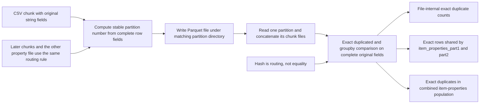
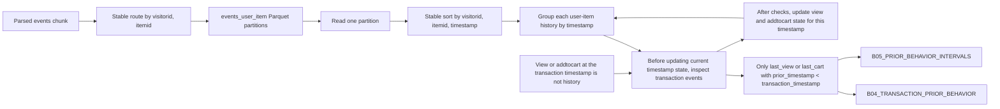

# Data Audit Data Flow

This document describes the data flow implemented by the current phase 3B audit code. It distinguishes implemented paths from specification targets and does not contain full-data findings, feasibility conclusions, or model results.

## Current implementation map

| Responsibility | Current implementation |
| --- | --- |
| CLI orchestration and scope selection | `src/data_audit/run_audit.py` |
| Input existence, exact headers, explicit columns/dtypes, chunk reading, and fingerprints | `src/data_audit/io.py` |
| Run-specific workspace, resource checks, stable partition routing, and Parquet partitions | `src/data_audit/partitioning.py` |
| Streaming profiles, exact duplicates, partitioned funnel, partitioned properties, and cross-source coverage | `src/data_audit/external.py` |
| In-memory event distributions, user sequences, item long tail, and time-split comparison | `src/data_audit/events.py` |
| In-memory category-tree integrity checks | `src/data_audit/properties.py` |
| Evidence metadata and tabular row accounting | `src/data_audit/evidence.py`, `src/data_audit/quality.py` |
| Evidence-gated feature and module matrix rules | `src/data_audit/matrices.py` |
| Evidence tables, manifest, matrix gate, and Markdown report writing | `src/data_audit/reporting.py` |

## End-to-end data flow

```mermaid
flowchart TD
    subgraph Raw["Read-only raw inputs"]
        EventsCsv["data/raw/events.csv"]
        Prop1Csv["data/raw/item_properties_part1.csv"]
        Prop2Csv["data/raw/item_properties_part2.csv"]
        TreeCsv["data/raw/category_tree.csv"]
    end

    subgraph Guard["Input and path protection"]
        InputCheck["File existence, non-symlink, exact header validation"]
        PathCheck["Output and temp paths must not be inside data/raw"]
        ResourceCheck["Temp write probe, free-disk estimate, optional RSS limit"]
        FingerprintBefore["Before fingerprint: metadata or SHA-256"]
        ReadOnlyRule["No audit writes to data/raw"]
    end

    EventsCsv --> InputCheck
    Prop1Csv --> InputCheck
    Prop2Csv --> InputCheck
    TreeCsv --> InputCheck
    InputCheck --> FingerprintBefore
    PathCheck --> ResourceCheck
    ReadOnlyRule --> InputCheck

    subgraph Read["Bounded CSV reading and parsing"]
        ChunkReader["iter_raw_chunks: chunk_size limits one read"]
        ColumnContract["Explicit usecols and pandas StringDtype"]
        Normalize["Normalize integer IDs and timestamps; count parse failures"]
        Scope["max_rows_per_file absent = full; present = smoke_non_evidentiary"]
    end

    FingerprintBefore --> ChunkReader
    Scope --> ChunkReader
    ChunkReader --> ColumnContract --> Normalize

    subgraph Workspace["Run-specific temporary workspace"]
        RunDir["data/tmp/data_audit/&lt;run_id&gt;"]
        StableRoute["stable_partition_ids with fixed pandas hash key"]
        Parquet["Parquet chunk files grouped by partition number"]
        RunStatus["run_status.json: prepared, partitioning, aggregating, writing_outputs, completed or failed"]
    end

    ResourceCheck --> RunDir
    Normalize --> StableRoute
    StableRoute --> Parquet
    RunDir --> Parquet
    RunDir --> RunStatus

    subgraph Routes["Implemented partition routes"]
        DupRoute["Exact duplicate route<br/>key = complete original row fields"]
        FunnelRoute["Funnel route<br/>key = visitorid, itemid"]
        PropertyRoute["Property history route<br/>key = itemid, property"]
        ValueRoute["Unique-value candidate route<br/>chunk-local exact distinct, then key = property, value"]
    end

    Normalize --> DupRoute --> StableRoute
    Normalize --> FunnelRoute --> StableRoute
    Normalize --> PropertyRoute --> StableRoute
    Normalize --> ValueRoute --> StableRoute

    subgraph Exact["Exact duplicate audit"]
        ReadDupPartition["Read one duplicate partition at a time"]
        ExactFields["Compare complete original fields inside the partition"]
        DupOutputs["A02: file-internal, cross-property-file, and combined exact duplicates"]
        TreeDup["category_tree internal duplicates: exact comparison on parsed categoryid and parentid in memory"]
        HashRule["Hash is routing, not equality"]
    end

    Parquet --> ReadDupPartition --> ExactFields --> DupOutputs
    TreeMemory --> TreeDup --> DupOutputs
    HashRule --> ExactFields

    subgraph EventAudit["Event audit"]
        EventsMemory["Current implementation: concatenate parsed events chunks in memory"]
        Behavior["B01-B03: event types, UTC-day trend, user behavior combinations"]
        UserSequence["C01-C03: user sequence metrics, percentiles, and buckets"]
        ItemTail["D01-D02: item behavior and long-tail concentration"]
        TimeSplit["F01: chronological split-scheme comparison"]
        FunnelPartition["Read events_user_item partitions and sort by visitorid, itemid, timestamp"]
        StrictPrior["For each transaction use only prior_timestamp &lt; transaction_timestamp<br/>same-timestamp view or addtocart is excluded"]
        FunnelEvidence["B04 and B05 evidence tables"]
    end

    Normalize --> EventsMemory
    EventsMemory --> Behavior
    EventsMemory --> UserSequence
    EventsMemory --> ItemTail
    EventsMemory --> TimeSplit
    Parquet --> FunnelPartition --> StrictPrior --> FunnelEvidence

    subgraph PropertyAudit["Property and category audit"]
        PairAggregate["Read item-property partitions; exact record, value, first/last time, change, and same-time multivalue aggregation"]
        PropertyEvidence["E01-E03: property profile, change, categoryid and available"]
        CoverageSets["Streaming item/category sets plus in-memory event item set"]
        CoverageEvidence["A03-A04: event/property/category cross-source coverage"]
        TreeMemory["Current RetailRocket category tree held in memory"]
        TreeAudit["A05-A06: roots, missing parents, self-loops, cycles, and resolved depth"]
    end

    Parquet --> PairAggregate --> PropertyEvidence
    Normalize --> CoverageSets --> CoverageEvidence
    Normalize --> TreeMemory --> TreeAudit

    subgraph Evidence["Evidence and run metadata"]
        EvidenceTables["EvidenceTable objects and CSV tables"]
        EvidenceMeta["evidence_id, population, denominator, data_scope"]
        Manifest["audit_manifest.json: configuration, fingerprints, resource use, partitions, table index, matrix status"]
        StatusLifecycle["run_status in temp workspace; manifest in output directory"]
    end

    DupOutputs --> EvidenceTables
    Behavior --> EvidenceTables
    UserSequence --> EvidenceTables
    ItemTail --> EvidenceTables
    TimeSplit --> EvidenceTables
    FunnelEvidence --> EvidenceTables
    PropertyEvidence --> EvidenceTables
    CoverageEvidence --> EvidenceTables
    TreeAudit --> EvidenceTables
    EvidenceMeta --> EvidenceTables
    RunStatus --> StatusLifecycle

    FingerprintAfter["After fingerprint and equality check"] --> Manifest
    EvidenceTables --> FingerprintAfter
    EvidenceTables --> Manifest
    StatusLifecycle --> Manifest

    Gate{"Publication gate by data_scope"}
    EvidenceTables --> Gate
    Manifest --> Gate

    subgraph SmokeOut["smoke_non_evidentiary outputs"]
        SmokeTables["output_dir/tables: annotated pipeline-validation tables"]
        SmokeReport["smoke_audit_report.md"]
        MatrixWithheld["matrix_generation_status.json<br/>withheld_pending_full_audit"]
        SmokeManifest["audit_manifest.json"]
    end

    Gate -->|"smoke_non_evidentiary"| SmokeTables
    Gate -->|"smoke_non_evidentiary"| SmokeReport
    Gate -->|"smoke_non_evidentiary"| MatrixWithheld
    Gate -->|"smoke_non_evidentiary"| SmokeManifest

    subgraph FullOut["full-scope formal outputs when a full run is executed"]
        FullTables["reports/tables/*.csv"]
        FeatureRules["FeatureRule catalog plus full evidence IDs and coverage values"]
        FeatureMatrix["reports/feature_feasibility_matrix.csv"]
        FeatureEvidence["G01 feature matrix evidence"]
        ModuleRules["ModuleRule catalog plus required full evidence IDs"]
        ModuleCsv["reports/data_feasibility_matrix.csv"]
        ModuleMd["reports/data_feasibility_matrix.md"]
        FullReport["reports/data_audit_report.md"]
        FiguresTarget["reports/figures: specification target; current code does not generate figures"]
    end

    Gate -->|"full only"| FullTables
    Gate -->|"full only"| FeatureRules
    EvidenceTables --> FeatureRules --> FeatureMatrix --> FeatureEvidence
    EvidenceTables --> ModuleRules
    FeatureEvidence --> ModuleRules
    ModuleRules --> ModuleCsv
    ModuleRules --> ModuleMd
    Gate -->|"full only"| FullReport
    Gate -.-> FiguresTarget
```

Chunking and hash partitioning solve different problems. `chunk_size` bounds the amount read from CSV in one operation. Stable partition routing then brings records with the same cross-chunk aggregation key into the same on-disk partition. The current implementation keeps parsed events in memory for non-funnel event audits, while complete item-property source tables are not concatenated in memory.

The hash value never establishes equality, so partitioning does not make exact duplicate or property statistics approximate. It only selects a destination. Exact comparison and aggregation use the original fields after each partition is read.

Both smoke and full runs use this same partition path. Setting `max_rows_per_file` changes `data_scope` to `smoke_non_evidentiary`; smoke tables and its report validate the pipeline but cannot publish formal matrix conclusions. A full run has not yet been executed. `reports/figures/` remains a specification target and is not written by the current code.

The temporary Parquet lifecycle is run-scoped. By default, a successful run writes `completed` and removes its run directory. `--keep-temp` preserves it. A caught failure writes `failed` and retains diagnostic files.

## Stable partitioning and exact duplicates

Chunk reading bounds memory, but chunk boundaries cannot be used as duplicate boundaries: the same row may occur in a later chunk or in the other property file. Stable routing places identical complete rows in the same partition across all chunks. The exact duplicate definition is an additional occurrence whose complete original source fields equal an earlier row under the named file or combined population. Hash collisions do not create duplicates because different original fields remain different during the final comparison.

The duplicate Parquet files live under the run-specific temporary directory. They are cleaned after a successful default run, retained with `--keep-temp`, or retained for diagnostics after a caught failure.

Smoke and full runs execute this same exact-comparison path. Smoke output remains non-evidentiary and cannot publish formal matrices; no formal full-data audit has been run. The small `category_tree` duplicate count is currently computed on parsed `categoryid` and `parentid` in memory rather than by rereading its raw duplicate Parquet route.

## Partitioned user-item funnel

Chunk reading limits per-read memory but cannot evaluate a user-item history that crosses chunk boundaries. Pair partitioning makes the complete history available together without loading every user-item pair into memory at once. The stable hash only routes a pair; all ordering and comparisons use the original parsed identifiers, event values, and timestamps, so the funnel is not approximate.

Within a partition, all events at one timestamp are considered as a batch. Transactions are evaluated before the batch updates `last_view` or `last_cart`. Therefore the implemented rule is strictly `prior_timestamp < transaction_timestamp`; same-timestamp behavior is excluded. B04 contains strictly prior behavior counts and shares, while B05 contains distributions of the most recent strictly prior view and add-to-cart intervals.

The pair Parquet files follow the same temporary-workspace cleanup, `--keep-temp`, and caught-failure retention policy. Smoke and full scopes use the same funnel path, but smoke B04/B05 outputs are non-evidentiary and cannot drive formal matrix publication. A formal full-data run has not yet occurred.

## Evidence and publication notes

- Every written evidence table is annotated with `evidence_id`, `population`, `denominator_definition`, and `data_scope`.
- `audit_manifest.json` records configuration, before/after input fingerprints, elapsed time, observed peak RSS, temporary-workspace policy, partition row/file counts, table index, and matrix status.
- `run_status.json` tracks the temporary workspace state. It is not a formal evidence table and may be removed by successful default cleanup.
- Feature and module matrices are generated from declarative rules only after their required evidence IDs resolve in a `full` run. Smoke mode writes a withheld status instead of formal matrices.
- The current implementation writes evidence CSV tables and Markdown reports. It does not currently create `reports/figures/`.
- No formal full-data audit has been run yet, so this document states processing architecture only and contains no dataset feasibility conclusions.
